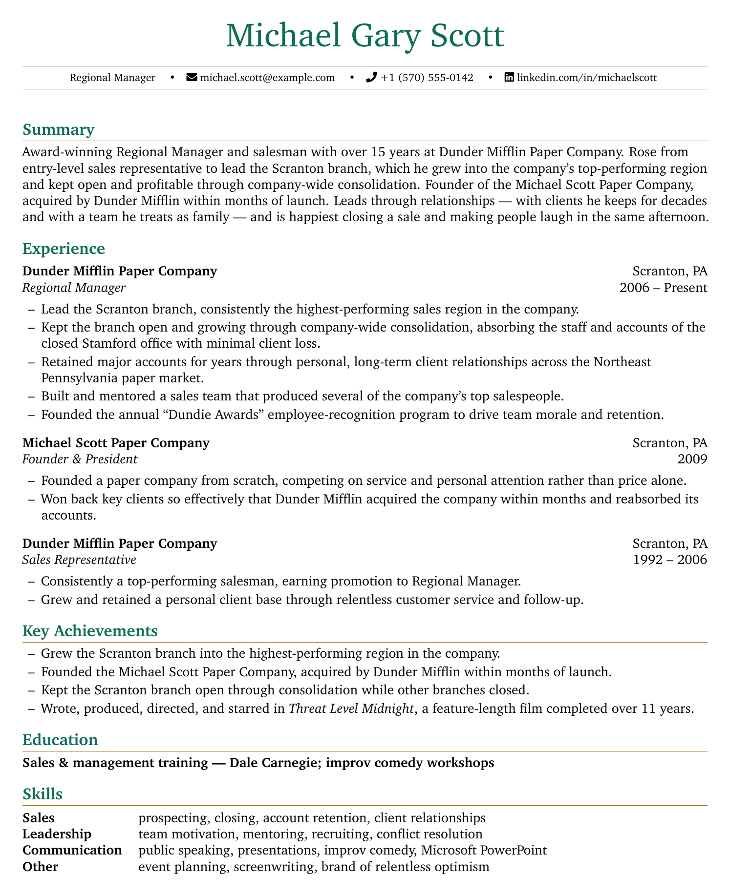
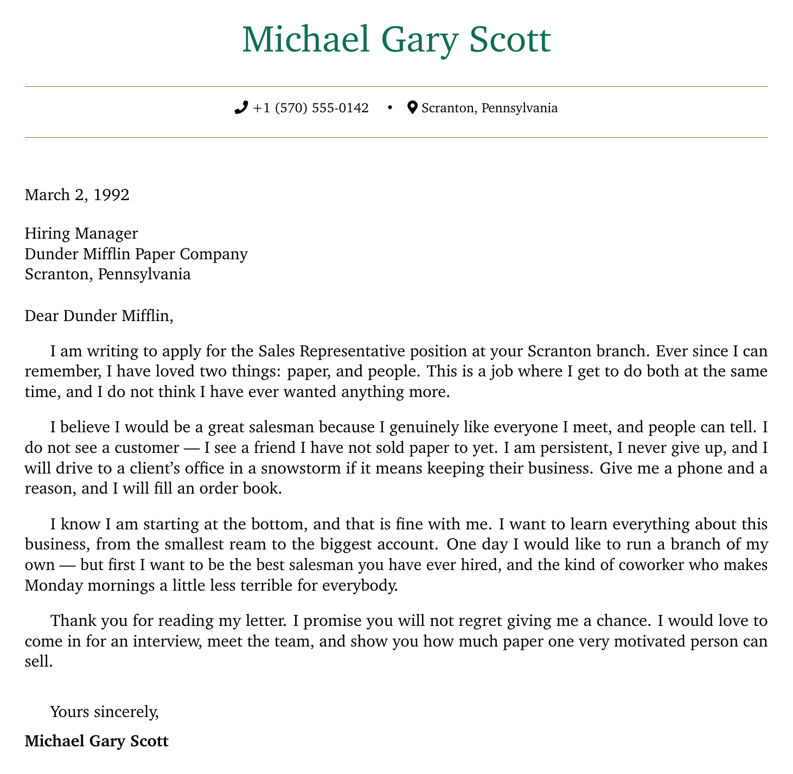

# cv-forge

[](LICENSE)
[](#quickstart)
[](https://claude.com/claude-code)

> **Organize your whole career once — then generate CVs that automated screening tools can actually read, tailored to each job, without ever inventing anything about you.**

<p align="center">
  
  &nbsp;&nbsp;
  
</p>

<p align="center"><sub>Sample CV and cover letter generated from a fictional profile (Michael Scott, <em>The Office</em>) in general mode — single-column, ATS-readable, with a real selectable text layer.</sub></p>

`cv-forge` is a pair of skills for AI coding agents. You build **one** structured record of your career, then generate a tailored CV for any job from it. It runs first on Claude Code; the shared installer also brings the skills to other AI agents.

---

## The problem it solves

Job hunting has two hidden hard parts:

- **Getting past the machines.** Applications are increasingly read first by automated, AI-powered screening (ATS). A CV that parses cleanly — right structure, right keywords, no layout traps — is hard to get right, and getting it wrong quietly sinks strong candidates.
- **Organizing your own story.** Pulling every role, result, skill, and qualification into one coherent picture is genuinely hard to do alone — especially across a long or varied career. Most people never have it all in one place.

`cv-forge` handles both: it interviews you to build that single record, then turns it into clean, ATS-readable CVs tailored to each job — using only what you actually told it.

---

## Quickstart

Install the skills with the shared `skills` CLI:

```bash
npx skills@latest add gianmadd/cv-forge
```

Then, in your agent (e.g. Claude Code):

1. **`/cv-profiler`** — answer the guided interview to build your **Career Profile**.
2. **`/cv-tailor`** — hand it that profile (and a job posting, if you have one) to generate a CV.

---

## How it works

Two skills, one pipeline. The **Career Profile** you build once is the single source of truth every CV is generated from:

```
      interview                    profile  (+ optional job posting)
You ─────────────▶ cv-profiler ──▶ Career Profile ──▶ cv-tailor ──▶ CV (+ cover letter)
```

### 1. [`cv-profiler`](skills/cv-profiler/SKILL.md) — build your Career Profile

A guided interview that captures your whole career in one structured document: roles, achievements and metrics, skills, education, languages, and more. Build it once and keep it.

- Adapts its questions to your profession — works for **any** field, not just tech.
- Saves as it goes, so you can stop and resume anytime.
- Notices things worth clarifying (gaps, overlapping roles, transferable skills) and asks with tact — it never assumes or fills in blanks for you.

### 2. [`cv-tailor`](skills/cv-tailor/SKILL.md) — generate a CV

Give it your profile — and, optionally, a job posting — and it produces a complete CV (and, on request, a cover letter), structured to parse cleanly and drawing **only** from your profile.

- **With a job posting:** tailored to the role, with the right experience and keywords surfaced.
- **Without one:** a complete, high-quality general CV from your profile's own positioning — not a draft.
- Renders in the language you choose and compiles to a clean PDF (Overleaf, or locally with a guided setup).
- Never fabricates: if it isn't in your profile, it doesn't appear.

---

## Principles

- **Zero fabrication.** Every fact, metric, and claim comes from you — nothing is invented, embellished, or estimated.
- **Polished, never invented.** Your wording gets refined where it helps — tone, clarity, grammar, structure — but the facts underneath always stay yours.
- **Works for any field.** The interview and the output adapt to your profession rather than forcing a single mould.
- **Multilingual.** The interview and the generated CV can each be in the language you choose.
- **Local and private.** Your profile never leaves your machine — see below.

---

## Privacy

Your Career Profile holds personal information and stays **entirely on your machine**. Nothing is sent anywhere except explicit, transparent web searches — and those never include your personal data. You decide what to store, and you delete the file whenever you no longer need it.

---

## Documentation

- [`docs/architecture.md`](docs/architecture.md) — how the two skills fit together and how they're distributed.
- [`docs/career-profile.md`](docs/career-profile.md) — the structure of the Career Profile document.
- [`docs/principles.md`](docs/principles.md) — the rules both skills follow.
- [`docs/decisions.md`](docs/decisions.md) — the design decisions behind the project, with rationale.
- [`docs/roadmap.md`](docs/roadmap.md) — what's built, what's next, and open questions.
- [`CONTEXT.md`](CONTEXT.md) — shared vocabulary.
- [`skills/cv-profiler/references/`](skills/cv-profiler/references/) — four range-spanning worked example Career Profiles (tradesperson, recent graduate, teacher, data analyst), shipped with the skill as few-shot.

---

## Status

**v1.0.0 — first public release.** Both skills, the CV / cover-letter templates, and four range-spanning example profiles are in place and verified end-to-end (profile → CV → PDF, plus an independently-graded interview eval of `cv-profiler`). See [`CHANGELOG.md`](CHANGELOG.md) for what shipped and [`docs/roadmap.md`](docs/roadmap.md) for what's next.

---

## Credits

The CV and cover-letter templates' visual style is adapted from Michael Lustfield's CV template, used under [CC-BY-4.0](https://creativecommons.org/licenses/by/4.0/).

## License

MIT — see [`LICENSE`](LICENSE).
